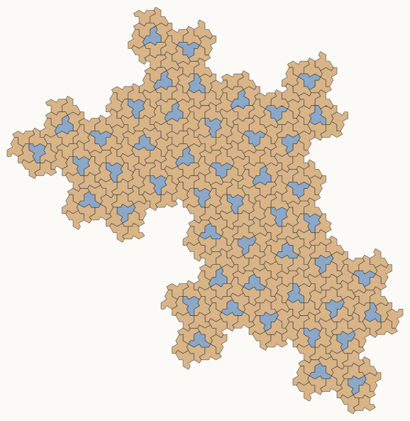

# Tessellation

这个项目用于整理和实验平面镶嵌相关的问题，尤其关注单一形状能否密铺平面、能否强迫非周期，以及如何用程序搜索新的候选形状。

## Hat 和 $\mathrm{Tile}(a,b)$ 族

2023 年发现的 hat 是第一个著名的平面非周期单砖例子。它属于一个连续族 $\mathrm{Tile}(a,b)$。这个族可以理解为在固定角度结构下改变两类边长参数得到的一族多边形；除去 $a=0$、$b=0$ 这两个退化情形，一般成员都是 13 边形。

几个重要特例：

- hat 对应 $\mathrm{Tile}(1,\sqrt{3})$。
- turtle 对应 $\mathrm{Tile}(\sqrt{3},1)$。
- $\mathrm{Tile}(1,1)$ 是特殊的等边情形。

这些对象之间有几种不同的密铺表示，需要区分：

- 普通 $\mathrm{Tile}(a,b)$ 族成员，例如 hat，在允许镜像的意义下强迫非周期密铺。
- $\mathrm{Tile}(1,1)$ 在禁止镜像、只允许平移和旋转时强迫非周期；但如果允许镜像，它可以周期密铺。因此它是弱手性非周期单砖。
- companion substitution 表示使用 $\mathrm{Tile}(a,b)$ 和 $\mathrm{Tile}(b,a)$ 一起拼。默认 $a=1, b=\sqrt{3}$ 时，就是 hat/turtle 表示。它和“一个 hat 加它自己的镜像”不是同一个表示。

当前项目中的相关脚本：

- `src/hat/tile_ab.py`：基于论文中的真实有限片镶嵌数据，生成 hat 与其镜像块组成的镶嵌。
- `src/hat/tile_one_one.py`：生成 $\mathrm{Tile}(1,1)$ 的同手性替换镶嵌。
- `src/hat/tile_ab_companion_substitution.py`：生成 $\mathrm{Tile}(a,b)$ 与 $\mathrm{Tile}(b,a)$ 的 companion substitution 镶嵌。

调用示例：

```bash
python src/hat/tile_ab.py -n 3 -o outputs/examples/hat_3.svg
```

```bash
python src/hat/tile_one_one.py -n 4 -o outputs/examples/tile_one_one_4.svg
```

```bash
python src/hat/tile_ab_companion_substitution.py -n 4 --a 1 --b 1.7320508075688772 -o outputs/examples/hat_companion_4.svg
```

## 镶嵌探索算法

### DFS算法

`src/tiling_explorer.py` 实现了一个从单块多边形出发的自动镶嵌探索程序。它像人工试拼一样探索，每一步选择一条裸露边，枚举新砖的边与它贴合的所有候选位置，过滤掉发生面积重叠或不满足长度组合限制的候选，然后沿深度优先搜索继续生长。

裸露边的选择使用“凹陷度”启发式。当前默认方法是把已放置区域低分辨率栅格化成二值图，已放置区域为黑色、背景为白色，再做高斯模糊；裸露边中点在模糊图上的灰度越黑，说明它越处在凹陷区域，越优先检查。旧的端点填充角指标仍保留为可选模式。优先检查凹陷处不是数学约束，而是为了更早发现局部矛盾：只要当前块的某条裸露边无法接上任何新砖，当前拼法就不可能扩展成完整镶嵌。

搜索使用显式 DFS 帧栈，而不是 Python 递归栈。每个栈帧保存一个父状态及其尚未尝试的候选列表，因此回溯或回跳后可以继续尝试同一层的其它摆法。程序还实现了 conflict-directed backjumping：当某条裸露边没有任何可行候选时，记录造成失败的责任块（包括候选块实际重叠到的已有块、提供当前裸露边的块，以及在长边被短边部分占据时共同决定该裸露段的相邻块（短边的所有者）），然后直接回跳到这些责任块中最晚放置的一块之前。

运行时可以导出多种调试数据：PNG 用于观察当前有限片镶嵌的形状，`trace.csv` 记录每个展开状态的块数、待尝试分支数、是否导出 PNG、回跳位置和单步耗时，HDF5 文件可逐步保存状态中每块的平移、旋转和镜像标记。以 hat 为例，若允许镜像并只尝试长度对 $(1,1)$、$(1,2)$、$(2,2)$ 和 $(\sqrt{3},\sqrt{3})$ 的拼贴，对应的命令行参数可写作 `--allowed-length-pairs "1:1,1:2,2:2,sqrt3:sqrt3"`；输出目录由 `--output-dir` 指定。

调用示例：

```bash
python src/tiling_explorer.py --preset hat --allow-reflection --allowed-length-pairs "1:1,1:2,2:2,sqrt3:sqrt3" --max-tiles 300 --max-states 20000 --export-every 100 --save-state-h5 --output-dir outputs/example-hat-search
```

### DFS 程序诊断程序

有的时候 DFS 程序实现会有疏漏，导致把存在正确拼法的分支剪枝。为了高效 debug，可以用一个已知的有限的镶嵌来检查 DFS 是否会把它剪掉，以及剪掉的原因。

`src/validate_dfs_against_known_tiling.py` 用一个已知的构造式有限镶嵌校验 DFS 是否错误回退。它会把参考镶嵌中的某个中心块对齐到 DFS 起点，截取一片足够大的参考区域，然后运行真实的 DFS；每次 DFS 准备回退时，脚本检查当前有限片镶嵌是否仍是参考镶嵌的子集，以及当前待处理边是否仍能由参考镶嵌继续填充。如果二者成立，脚本会保存现场 HDF5、叠图 PNG 和候选诊断 JSON，便于定位候选枚举、碰撞判断或剪枝逻辑的问题。

最初开发此诊断程序时，使用的参考来源是 `src/hat/tile_one_one.py` 的 $\mathrm{Tile}(1,1)$ 构造式镶嵌。

调用示例：

```bash
python src/validate_dfs_against_known_tiling.py --known-source tile11-substitution --iterations 3 --allowed-length-pairs "1:1,1:2,2:2" --max-states 20000 --output-dir outputs/example-dfs-validation
```

### 坑

- eb1cff6e3d80fa22628ea1731d9d41b8ba5f3e86 这次 commit 前，接触长度用吸附到当前边界后的几何计算，但连通性仍用未吸附的原始候选计算，导致数值上的极小缝隙把合法候选误判成多个不连通多边形。
- 29fcaa07395849fb46ccf421e52b650f25db21e7 这次 commit 前，在候选通过了吸附后的检查后，仍把未吸附的原始候选保存进后续状态，导致极细裂缝累积，并在之后的边界提取中变成伪裸露边。现在接触判断、连通判断和后续状态保存都使用同一套吸附后的候选几何。

## 搜索算法设想

目标是搜索新的可镶嵌候选形状，尤其是可能强迫非周期的单一形状。一个设想是不直接枚举任意多边形坐标，而是从周期性点集或周期性 cell graph 出发。

基本思路：

1. 选择一个周期性点集或周期性 cell graph。
2. 每个点对应一个 Voronoi 单元；如果点集中存在多种局部处境，就可能有多种单元类型（不用真的计算 Voronoi 图，只在点阵层面尝试密铺）。
3. 在离散图层面枚举由 `k` 个相邻 cell 构成的连通 polyform。
4. 对枚举出的 polyform 做去重。
5. 将每个 polyform 当作一个候选单砖，尝试在有限区域上做 exact cover、回溯或 SAT 求解。
6. 对能铺较大有限区域的候选，继续搜索周期铺法；若找到周期铺法，则淘汰。
7. 对剩余候选，计算真实 Voronoi 多边形并合并对应 cell，导出图片供人工筛选。

torus exact cover 可用来搜索周期铺法：把周期图按两个独立平移向量取有限商，也就是把一个超胞的相对边周期性粘起来，然后在这个 torus 上做 exact cover。实现时可用按面积从小到大枚举。若找到解，则候选存在周期密铺，淘汰。

## 动画和音频渲染

本项目的代码还可以将镶嵌探索算法的输出渲染为动画（图像序列）和音频。

动画和音频渲染所需的输入是 `src/tiling_explorer.py --save-state-h5` 生成的一组逐步状态文件。渲染时先调用 `src/render_tiling_animation.py`，传入状态目录、输出目录、预设形状和时间范围。脚本会输出主画面 PNG 序列到输出目录下的 `frames` 或 `--frames-name` 指定的子目录，把消失块的红叉输出为透明背景 PNG 序列到 `removal_crosses`，并生成 `audio_events.h5` 作为音频事件缓存。

`src/render_tiling_animation.py` 的常用参数可以分成几类：

- `--input-dir` 指向探索程序导出的 HDF5 状态目录，`--output-dir` 指向动画输出目录，`--preset` 需要与探索时的形状一致，`--start-step` 和 `--end-step` 决定渲染哪一段搜索过程。
- `--duration`、`--fps`、`--width`、`--height`、`--supersample` 控制总时长、帧率、分辨率和抗锯齿倍率。
- `--time-gamma` 控制搜索步骤映射到视频时间的非线性程度，大于 1 时开头更慢、后面更快。
- `--camera-fill`、`--camera-alpha`、`--initial-zoom-factor` 控制自适应相机的取景比例、平滑速度和初始缩放。
- `--background`、`--color-mode`、`--fill-alpha`、`--noise-alpha-amplitude`、`--pulse-alpha-amplitude`、`--red-shift` 和 `--red-decay-seconds` 控制主画面样式。默认 `--color-mode handedness` 按手性使用黄/蓝两色，`--color-mode angle` 则按块的旋转角度取 HSL 色相，并用 `--angle-saturation` 和 `--angle-lightness` 指定饱和度和亮度。
- `--cross-half-life`、`--cross-size-diameters` 和 `--cross-stroke-fraction` 控制消失块红叉图层。
- `--skip-removal-crosses` 和 `--skip-audio-events` 用于只重渲染主画面，跳过红叉和音频事件缓存。

默认风格调用示例：

```bash
python src/render_tiling_animation.py --input-dir outputs/example-hat-search --output-dir outputs/example-hat-animation --start-step 0 --end-step 19800 --duration 60 --fps 30 --width 1920 --height 1080 --time-gamma 2.0
```

白色背景、按角度着色，并把主画面输出到单独子目录的调用示例：

```bash
python src/render_tiling_animation.py --input-dir outputs/example-tile11-search --output-dir outputs/example-tile11-animation --preset tile11 --start-step 0 --end-step 7600 --duration 60 --fps 30 --width 1920 --height 1080 --time-gamma 2.0 --background "#ffffff" --color-mode angle --angle-saturation 0.58 --angle-lightness 0.50 --frames-name frames_angle_tile11 --skip-removal-crosses --skip-audio-events
```

有了 `src/render_tiling_animation.py` 导出的音频事件缓存文件，就可以调用 `src/bake_audio.py` 烘焙出音频，例如 `python src/bake_audio.py --events <animation-dir>/audio_events.h5 --output-dir <animation-dir>`。它会输出添加块和删除块两条 WAV 音轨；烘焙阶段会给事件加入可调的随机时间抖动和左右声道到达时间差以产生立体声效果。设计音频事件缓存文件的目的是在调整音色、抖动或声像参数时，不需要重新读取大量逐步状态文件（这通常很耗时）。

调用示例：

```bash
python src/bake_audio.py --events outputs/example-hat-animation/audio_events.h5 --output-dir outputs/example-hat-animation
```

## 参考文献

- David Smith, Joseph Samuel Myers, Craig S. Kaplan, Chaim Goodman-Strauss, [An aperiodic monotile](https://arxiv.org/abs/2303.10798), 2023.
- David Smith, Joseph Samuel Myers, Craig S. Kaplan, Chaim Goodman-Strauss, [A chiral aperiodic monotile](https://arxiv.org/abs/2305.17743), 2023.
- Craig S. Kaplan, [Hat monotile resources](https://cs.uwaterloo.ca/~csk/hat/).
